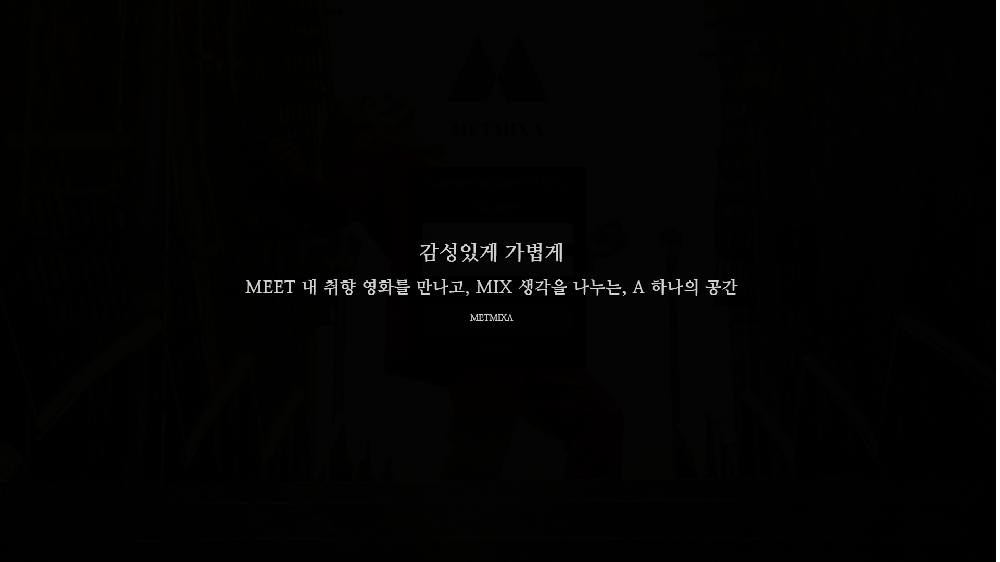
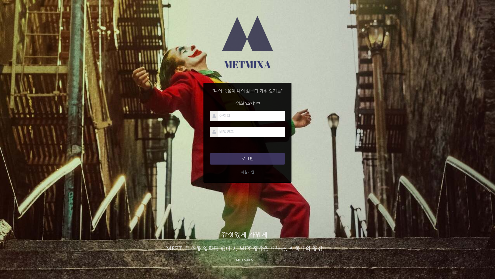
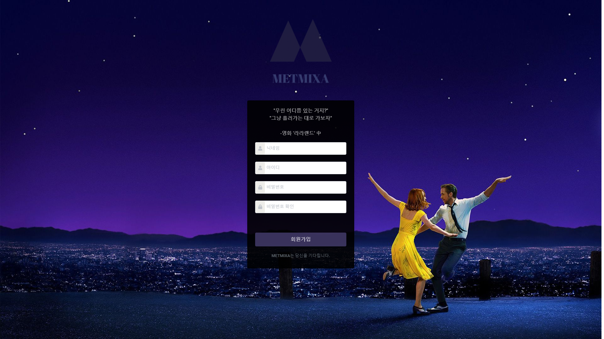
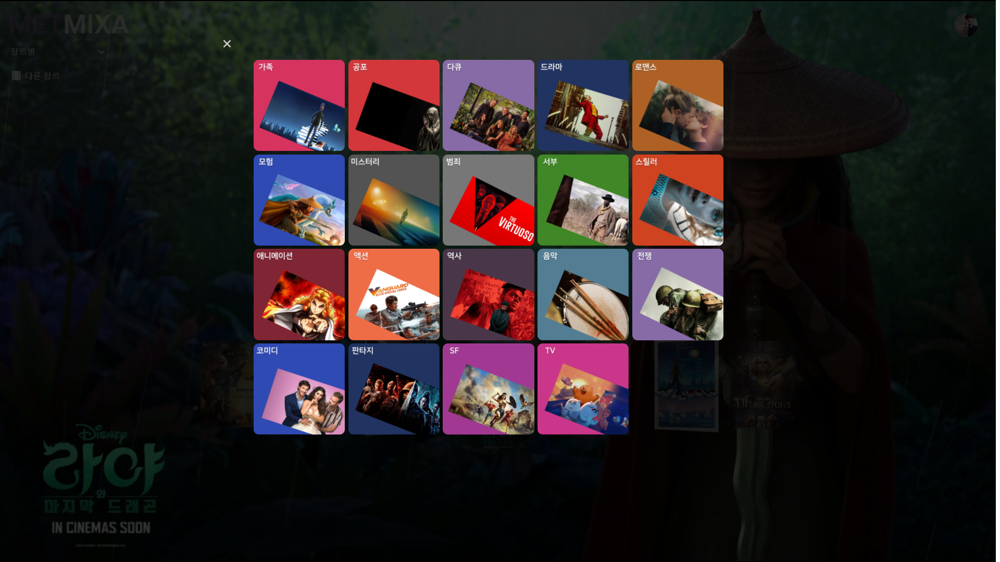
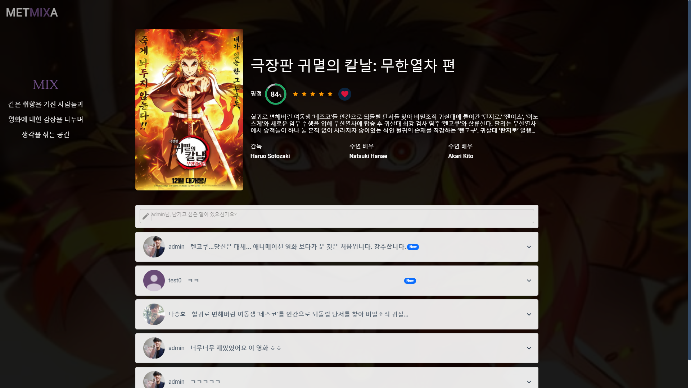
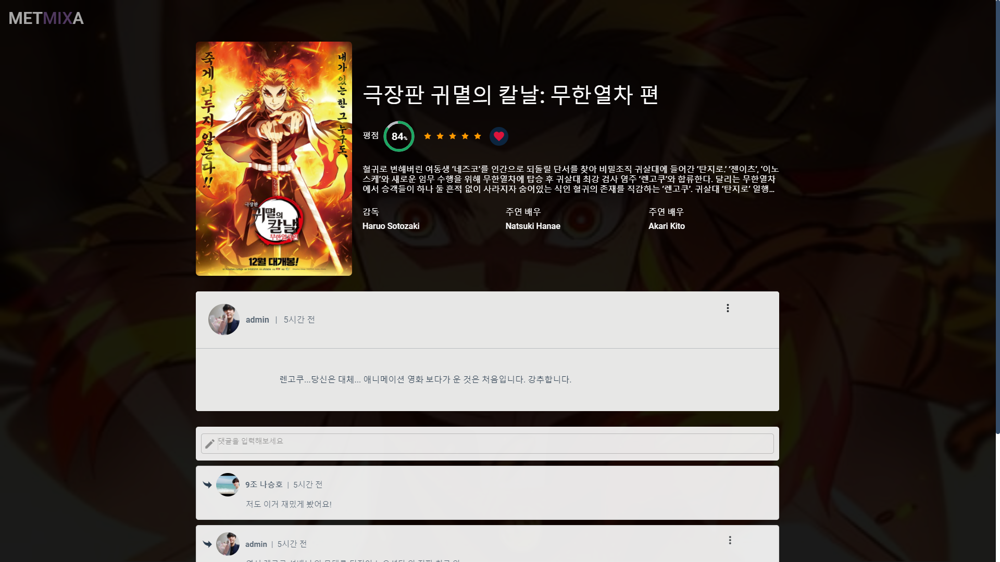
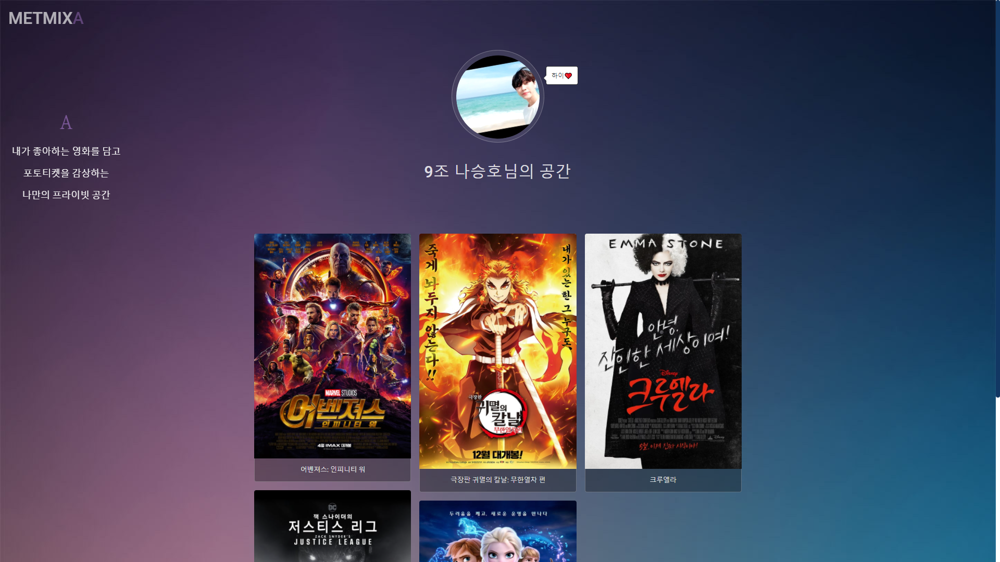
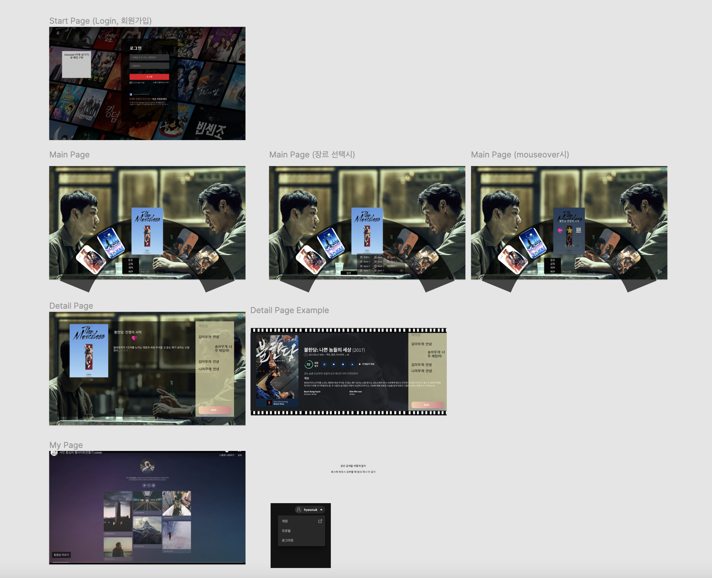

# 🏆Final pjt

> Django REST API와 Vue.js를 활용한 영화 추천 및 커뮤니티 사이트

<br/>

# "METMIXA"

> Meet + Mix + A

<br/>

<br/>

# 결과물 Preview
















<br/>

<br/>

<br/>

## 개발 환경

### 1. 개발 스택

- Python
- Django
- HTML
- CSS
- JavaScript
- Vue.js

<br/>

<br/>

### 2. 설치

+ python

```npm
python -m venv venv
source venv/Scripts/activate
python manage.py migrate
python manage.py runserver
```

+ vur

```
npm i
npm run serve
```

<br/>

<br/>

<br/>

## 목표 설정

- 한 학기동안 사용한 모든 툴을 활용해볼 것
- 1️⃣등 하기
- 팀원 모두가 프로젝트 전체를 이해할 수 있도록 분업보다는 협업을 위주로 할 것
- Scrum meeting을 통해 팀원과 프로젝트 진행 상황을 공유할 것

<br/>

<br/>

<br/>

## Design Thinking

### 1. 페르소나 (타겟)

#### 페르소나1

- 복잡한 UI를 싫어하고 감성과 편리함을 추구하는 MZ세대
- 디지털 환경에 익숙하고 최신 트랜드와 남과 다른 이색적인 경험을 추구
- 개인의 행복 개인화 차별화

#### 페르소나2

- 영화 정보와 리뷰 사이트를 이용하고 싶은 저시력 시각 장애인

<br/>

<br/>

### 2. POV (Point of View)

- 영화에 관심이 많은 MZ세대는 감성적인 UI를 가지면서도 간편하게 사용할 수 있는 영화 정보 사이트가 필요하다. 왜냐하면 MZ세대는 더 이상 글을 선호하지 않고 감성적인 디자인을 추구하며, 3번의 클릭 내에 웹사이트의 모든 곳을 갈 수 없는 웹사이트는 사용자의 경험을 감소시키기 때문이다.
- 저시력 시각 장애인은 자신이 선택한 부분에 대한 텍스트를 읽어주는 서비스가 필요하다. 왜냐하면 저시력 시각 장애인은 화면의 UI를 어느정도 인식해 원하는 작업을 할 수 있지만 텍스트 정보를 읽는 데에 불편함을 겪고 있기 때문이다.

<br/>

<br/>

### 3. HMW (How might we)

- 글을 최대한 줄인 영상, 이미지 위주의 UI설계
- 3번의 클릭 내에 사이트의 모든 곳에 도달할 수 있도록 페이지 설계
- 네이버 CLOVA API를 이용해 Mouseover 이벤트 발생 시 해당 타겟에 대한 내용을 읽어줌

<br/>

<br/>

<br/>

## Web page prototype



<br/>

<br/>

<br/>

## ERD

.png)

- 주모델: 영화, 유저, 리뷰, 댓글, 장르
    - 1:N 참조 관계: 유저-리뷰, 영화-리뷰, 유저-댓글, 리뷰-댓글

- 중개모델(M:N):
    - 포토티켓(영화-유저), 평점(영화-유저), 유저_장르_점수(영화-유저), 영화-장르, 영화-감독, 영화-배우

- 유저_장르_점수(추천 알고리즘)
    - 유저에게 영화를 추천하는 알고리즘을 짜기 위해 생성한 관계
    - 유저가 평점을 준 영화의 장르 정보들을 통해서 유저게 영화를 추천할 것이다.

- vote average
    - 기존 영화 평점 - 초기값이 없기 때문에 `tmdb 영화 평점`을 쓸 것
    - 사용자가 평점을 줄 때마다 평점도 업데이트 되어야 함
    - vote average(계산이 복잡하므로) 대신 `vote sum`, `vote count` 데이터를 가지고 있음

- 인기도, 평점 업데이트
    - `popurality`, `tmdb_vote_sum`, `tmdb_vote_cnt` 필드만 업데이트

        updated tmdb 총점 +  our 총점
        —————————————————
        updated tmdb 개수 + our 개수

<br/>

<br/>

<br/>

## Back end

### 0. 구조

- api(프로젝트)
- account(계정 앱)
- movie(서비스 관련 앱)

<br/>

<br/>

### 1. MtoM에서 원하는 필드 추가하는 법

```python
from django.db import models

class Doctor(models.Model):
    name = models.TextField()

    def __str__(self):
        return f'{self.pk}번 의사 {self.name}'

class Patient(models.Model):
    name = models.TextField()

    def __str__(self):
        return f'{self.pk}번 환자 {self.name}'

# 직접 중개모델을 생성
class Reservation(models.Model):
    doctor = models.ForeignKey(Doctor, on_delete=models.CASCADE, related_name='reservations')
    patient = models.ForeignKey(Patient, on_delete=models.CASCADE, related_name='reservations')
    message = models.CharField(max_length=50)

    def __str__(self):
        return f'{self.doctor_id}번 의사의 {self.patient_id}번 환자'
```

- `Reservation.objects.create(doctor=doctor인스턴스, patient=patient인스턴스, message=문자열)`
- `Doctor.reservations.get(patient=patient1)`

<br/>

<br/>

### 2. DB 구축 API에서 장르-영화, 영화-감독, 영화-배우 간 M:N 관계 설정해주기

- 문제 상황
    - tmdb API를 통해 정보를 받아와 장르, 영화, 감독, 배우 테이블을 `bulk_create` 를 통해 구성
    - 테이블 간의 M:N관계를 설정해주어야 하나 `bulk_create` 에서 create 작업을 통째로 하기 때문에 각각의 생성된 객체에 중개모델 데이터를 넣어주기 위한 `add` 작업 불가

```python
Director.objects.bulk_create(
		[Director(
	      name = data.get('name'),
	      original_name = data.get('original_name'),
	      ) for data in req.get('crew') if not Director.objects.filter(name=data.get('name')).exists() and data.get('job') == 'Director']
)
```

- 해결
    - `bulk_create` 가 실행속도가 빠르나, 중개모델에 데이터를 넣어줘야 하는 우리의 상황에서는 적절하지 않은 방법임을 깨닫고 다음의 방법을 통해 해결
        1. `for` 문을 통해 각각의 정보를 순회하며 `Model.objects.create` 로 객체를 하나씩 생성
        2. 반환되는 객체를 변수에 담아 `변수.중개모델manager.add(모델)` 로 중개모델 데이터 추가

```python
for data in req.get('crew'):
		if not Director.objects.filter(name=data.get('name')).exists() and data.get('job') == 'Director':
		    director = Director.objects.create(name=data.get('name'), original_name=data.get('original_name'))
		    director.movies.add(movie)
```

<br/>

<br/>

### 3. Movie 정보를 받아올 때 DB에 영화가 존재하는지에 따라 업데이트/생성 분기

- 구현 목표
    - API를 통해 Movie 정보를 받아올 때 분기가 발생
        1. 받아온 정보가 DB의 내용과 중복되는 경우 기존의 영화 정보 업데이트
        2. 중복되지 않는 경우 새로 영화 정보 추가

- 방법
    - `objects` 매니저의 `filter`와 `exists()`를 활용해 현재 영화 정보가 DB에 존재하는지 확인
    - 존재하면 `title` 을 사용해 기존 영화 정보 객체를 가져와 `popularity`, `tmdb_vote_sum`, `tmdb_vote_cnt` 필드값 업데이트
    - 존재하지 않으면 `create`를 사용해 새로운 정보 객체 생성 후 저장

```python
...
# 이미 DB에 있는 영화면 정보를 업데이트
if Movie.objects.filter(title=data.get('title')).exists():
    movie = Movie.objects.get(title=data.get('title'))
    movie.popularity = data.get('popularity')
    movie.tmdb_vote_sum = data.get('vote_average') * data.get('vote_count')
    movie.tmdb_vote_cnt = data.get('vote_count')
    movie.save()
# DB에 없는 영화면 새로 생성
else:
	movie = Movie.objects.create(...)
```

 <br/>

<br/>

### 4. 사용자 API

- 사용자 API
    - 데코레이터를 통해 인증된 사용자만 사용 가능, 일부는 관리자만 사용 가능

```python
@authentication_classes([JSONWebTokenAuthentication]) # JWT가 유효한지
@permission_classes([IsAuthenticated]) # 인증 여부를 확인
```

- **추가로 accounts/views.py/profile 함수의 경우 데코레이터가 없을 시 미인증 에러 발생**

- 포토티켓은 Vue에서의 infinite scroll 구현을 위해 django의 `Paginator`를 사용하여 페이지를 구분해서 결과 반환
    - Profile Page에서 무한 스크롤 진행 시 `최대 페이지 수`를 넘겨도 계속 무한 스크롤 되는 이슈 발생
        - views.py에서 `최대 페이지 수` 정보를 추가해서 넘겨서 → vue에서 해당 정보를 이용해서 `현재 페이지 수`가 `최대 페이지 수` 이하일 때만 무한 스크롤 기능 작동하게 함

- 추천 알고리즘 기능을 위해서 사용자가 영화에 평점을 주는 동시에 유저-장르-점수 중개테이블에 데이터 추가
    1. rate 함수를 GET, POST, PUT에 따라 분기처리
    2. POST는 단 한 번만 실행되어야 한다(사용자는 한 영화에 한 개의 평점만 생성할 수 있음)

        Vue에서 if문 분기처리 필요(GET을 하고 인스턴스가 존재하면 PUT, 존재하지 않으면 POST)

    3. rate 함수 실행과 동시에 유저-장르- 점수 중개테이블을 채우는 기능이 작동

```python
# rate GET 방식일 때 내부에서 실행되는 함수
# 1. movie에 대한 장르 아이디들을 받아옴
genres = Genre.objects.filter(movies__pk=movie_pk)
    if request.method == 'GET':
        serializer = RateSerializer(rate)
        return Response(serializer.data)
```

```python
# rate POST 방식일 때 내부에서 실행되는 함수
# 2. for문을 통해 각 장르 아이디들에 대해서 유저장르점수 객체를 만듦
for genre in genres:
    serializer_algo = RecommendAlgoScoreSerializer(data=request.data)
    if serializer_algo.is_valid(raise_exception=True):
        serializer_algo.save(genre=genre, user=request.user)
```

```python
# rate POST 방식일 때 내부에서 실행되는 함수
# 3. for문을 통해 각 장르 아이디들에 대해 유저장르점수 객체 업데이트
for genre in genres:
		recommend_algo_score = RecommendAlgoScore.objects.filter(user__pk=request.user.pk, genre__pk=genre.pk).first()
    serializer_algo = RecommendAlgoScoreSerializer(recommend_algo_score, data=request.data)
    if serializer_algo.is_valid(raise_exception=True):
	    serializer_algo.save()
```

<br/>

<br/>

### 5. 추천 알고리즘

- `random.choices` 를 활용하여 각 장르에 가중치를 주고 랜덤한 장르를 6개 뽑아서 추천(중복 가능)
    - choices는 중복을 허용하기 때문에 뽑히는 장르들 또한 중복값이 존재(ex. 12 12 23 24)
    - 이 또한 가중치를 통한 랜덤의 묘미(가중치가 높은 장르만 뽑힐 수도 있음)

- 사용자가 각 장르에 준 평점의 누적합을 구해 각 장르의 가중치 설정
    - `RecommendAlgoScore` 테이블에 유저가 영화에 평점을 줄 때마다 해당 영화가 가진 장르에 대한 유저의 평점 값이 저장

- 뽑은 장르들에 대해 `for` 문으로 순회하며 각 장르에 해당하는 영화를 인기있는 영화부터 차례로 25개씩 가져온 쿼리셋을 합집합
    - 만약, 한 영화가 뽑힌 장르들을 여러개 가지고 있다면 이 영화는 여러번 쿼리셋에 담김. 이를 통해 자연스럽게 뽑힌 장르들을 중복으로 가지고 있는 영화들이 쿼리셋을 차지하고 적게 가지고 있는 영화들이 담기지 않게 됨

```python
@api_view(['GET'])
@authentication_classes([JSONWebTokenAuthentication])
@permission_classes([IsAuthenticated])
def movie_list(request):
    mode = request.GET.get('mode')
    # 추천 0. mode - 알고리즘
    if mode == 'algorithm':
        weight = []
        # 19가지 장르의 pk
        for id in range(1, 20):
            genre_weight = RecommendAlgoScore.objects.filter(user__pk=request.user.pk, genre__pk=id).aggregate(Sum('rate'))['rate__sum']
            weight.append(genre_weight if genre_weight else 1)

        recommend_genre_ids = random.choices([28, 12, 16, 35, 80, 99, 18, 10751, 14, 36, 27, 10402, 9648, 10749, 878, 10770, 53, 10752, 37], weight, k=6)

        movies = Movie.objects.none()
        for genre_id in recommend_genre_ids:
            temp_movies = Movie.objects.filter(genres__tmdb_genre_id=genre_id)[:25]
            movies = movies|temp_movies
```

<br/>

<br/>

### 6. 영화 조회 및 검색

- Select 박스를 통해 사용자가 선택한 방식에 따라 영화들을 뿌려줌
    - 위의 추천 알고리즘 코드에 이어서 작성된 부분
    - ORM문에서 `filter` 를 사용할 때 `lookup` 을 사용해서 M:N관계에서의 정보들을 원하는대로 뽑아올 수 있음

```jsx
# 조회 1. mode - 최신순, 평점순, 인기순
    elif mode in ('release_date', 'vote_average', 'popularity'):
        if mode != 'vote_average':
            movies = Movie.objects.order_by(f'-{mode}')[:100]
        else:
            movies = Movie.objects.annotate(vote_average=(F('tmdb_vote_sum') + F('our_vote_sum')) / (F('tmdb_vote_cnt') + F('our_vote_cnt'))).order_by('-vote_average')[:100]
    elif mode in ('director', 'actor', 'title'):
    # 조회 2. mode - 감독별, 배우별, 영화명별
        inputValue = request.GET.get('inputValue')
        if mode == 'director':
            # MtoM 관계에서 원하는 조건을 가지는 영화들을 가져오는 방법
            # https://docs.djangoproject.com/en/3.2/topics/db/examples/many_to_many/
            movies = Movie.objects.filter(Q(directors__name__icontains=inputValue)|Q(directors__original_name__icontains=inputValue)).distinct()[:100]
        elif mode == 'actor':
            movies = Movie.objects.filter(Q(actors__name__icontains=inputValue)|Q(actors__original_name__icontains=inputValue)).distinct()[:100]
        else:
            # 한글 제목이나 원본 제목이 사용자의 입력(inputValue)를 포함하는 영화들을 반환(대소문자 구분하지 않음)
            movies = Movie.objects.filter(Q(title__icontains=inputValue)|Q(original_title__icontains=inputValue))[:100]
    # 조회 3. mode - 장르별
    elif mode == 'genre':
        inputGenre = request.GET.get('inputGenre')
        movies = Movie.objects.filter(genres__tmdb_genre_id=inputGenre)[:100]

    serializer = MovieListSerializer(movies, many=True)
    return Response(serializer.data)
```

<br/>

<br/>

<br/>

## Front end

### Login Page

- CSS 애니메이션을 통해 splash screen 구현
    - `opacity` 와 `position` 조절

```html
<!-- 커버 화면 -->
<template>
    <div class="login-cover"></div>
    <div class='cover-textCenter text-slide'>
        <h1 class="text-slide">감성있게 가볍게</h1>
        <h2 class="text-slide">MEET 내 취향 영화를 만나고, MIX 생각을 나누는, A 하나의 공간</h2>
        - METMIXA -
    </div>
</template>

<style>

.login-cover {
  position: fixed;
  z-index: 3;
  width: 100vw;
  height: 100vh;
  background-color: black;
  animation: fadeout 3s;
  animation-fill-mode: forwards;
  animation-delay: 1.55s;
}
    
@keyframes fadeout {
    from {
        z-index: 3;
        opacity: 1;
    }
    to {
        z-index: -1;
        opacity: 0;
    }
}

.text-slide {
  animation-name: slide;
  animation-delay: 1.75s;
  animation-duration: 2s;
  animation-duration: leaner;
  animation-fill-mode: forwards;
}

@keyframes slide {
  0% {
    top: 45%;
    transform: scale(1)
  }
  100% {
    top: 83%;
    transform: scale(0.8)
  } 
}

.cover-textCenter {
  position: fixed;
  width: 100%;
  top: 45%;
  left: 2%;
  z-index: 6;
  margin-left: -50px;
  margin-top: -25px;
  color: rgba(255, 255, 255, 0.82);
  font-family: 'Nanum Myeongjo', serif;
}

.cover-textCenter > h2 {
  font-family: 'Nanum Myeongjo', serif;
}

.cover-textCenter > h1  {
  padding-bottom: 1rem;
}

</style>
```

- 웹페이지를 켰을 때 브라우저 창 크기로 캐러샐 크기 설정
    - 브라우저 창 최대 크기를 알아야 함
        - `windowWidth: parseInt(screen.availWidth)+"px"` ,
        - `width: windowWidth` 를 통해 해결

- 상황 별 모달 창 메시지 분기 처리 필요
    - "아이디를 입력하세요."
    - "비밀번호를 입력하세요."
    - "아이디와 비밀번호를 확인하세요."

<br/>

<br/>

### Signup Page

- 웹페이지를 켰을 때 브라우저 창 크기로 캐러샐 크기 정해짐
    - 브라우저 창 최대 크기를 알아야 함
        - `windowWidth: parseInt(screen.availWidth)+"px"` ,
        - `width: windowWidth` 를 통해 해결함
- 상황 별 모달 창 메시지 분기 처리 필요
    - "필수 정보를 모두 입력해주세요."
    - "일치하는 아이디가 존재합니다."
    - "일치하는 닉네임이 존재합니다."
    - "비밀번호가 일치하지 않습니다."
- 회원가입 후 Login Page로 이동하지 않고 바로 로그인 기능 실행, Main Page로 이동

<br/>

<br/>

### Profile Page

- 구현 기능
    - Detail Page 혹은 ReviewComment Page에서 담은 포토티켓을 확인할 수 있음
    - 프로필 닉네임, 이미지를 변경하여 프로필을 커스텀할 수 있음

- Infinite Scroll 구현
    - 최하단 페이지에 도달했을 때  `최대 페이지 수`를 넘겨도 마지막 페이지가 계속 로드되는 이슈 발생
        - `Paginator` 객체가 갖고 있는 `num_pages` 가 최대 페이지를 갖고 있으므로 이에 대한 정보를 Vue에 넘겨줘 해결
        - Vue에서는 `passiblePageNum` 이라는 이름으로 받음

```python
# Back

@api_view(['GET'])
@authentication_classes([JSONWebTokenAuthentication])
@permission_classes([IsAuthenticated])
def photo_ticket_list(request):
    photo_tickets = PhotoTicket.objects.filter(user__pk=request.user.pk)
    paginator = Paginator(photo_tickets, 12)
    page_num = request.GET.get('page_num')
    photo_tickets = paginator.get_page(page_num)
    serializer = PhotoTicketSerializer(photo_tickets, many=True)
    data = serializer.data
    data.append({'possible_page': paginator.num_pages})
    return Response(data)
```

```jsx
// Front

getMovies: function () {
      axios({
        method: 'get',
        // 장고한테 요청
        url: 'http://127.0.0.1:8000/api/v1/phototickets/',
        params: {
          page_num: this.pageNum,
        },
        headers: this.config
      })
      .then((res)=>{
        // 응답 데이터에서 가능한 페이지 수 데이터만 pop해서 가져온다.
        this.possiblePageNum = res.data.pop()['possible_page']
        this.photoTickets.push(...res.data)
        this.pageNum += 1
      })
      .catch((err) => {
        console.log(err)
      })
    },
```

```jsx
checkBottom: function () {
      const {scrollTop, clientHeight, scrollHeight} = document.documentElement
      if (scrollHeight - scrollTop <= clientHeight) {
        if (this.pageNum <= this.possiblePageNum) {
          this.getMovies()
        }
      }
```

- 프로필 수정 시 상황별 모달 창 메시지 분기 처리 필요
    - "닉네임을 입력해주세요."
    - "이미지를 선택해주세요."

- 프로필 이미지 업로드를 시도할 때 `@change` 이벤트를 통해서 이미지 파일이 전달되지 않음
    - `el-component`에서 제공하는 태그를 사용해서 `event`가 제대로 된 역할을 하지 못하는 상황
    - `@change.native`를 사용하여 `file`을 제대로 전달 받아 올 수 있음

```html
<el-input
	@change.native='onGetFile'
	type="file"
	accept="image/*"
	v-model="credentials.image"
	placeholder="image"
	prefix-icon="el-icon-picture-outline"
></el-input>
```

- 프로필 페이지에서 모달창 종료 불가
    - `profile` 에서 modal 창이 `submit event` 후에도 모달창이 닫히지 않음
    - `click event`를 활용하여 해결

<br/>

<br/>

### Main Page

- 구현 기능
    - `Carousel`형태의 추천된 영화 리스트
    - 선택된 영화의 트레일러 제공 (배경)
    - 다양한 기준으로 영화를 조회하는 기능 제공 - 추천 영화, 장르별, 인기순, 최신순,  평점순, 영화명, 감독명(영문), 배우명(영문)
    - 영화 클릭 시 Detail Page로 이동
    - 오른쪽 상단 프로필 아이콘 클릭 시 화면 우측에서 사이드 바 메뉴(Profile, Logout)가 나타남
- 영화를 조회할 때 메인 카드에 가장 첫 번째 순서로 나와야 할 영화를 보여주지 않음
    - 새로고침하지 않으면 캐러셀의 인덱스가 초기화 되지 않아 문제가 발생
    - `watch`를 사용하여 영화 조회 시 영화 리스트가 변경됐을 때 초기 인덱스를 잡아주는 것으로 문제를 해결
- 기본적인 기능 구현 및 스타일링에서 잔 이슈가 많았지만 모두 해결

<br/>

<br/>

### Detail Page

- 구현 기능
    - Main Page에서 선택한 영화의 상세정보 제공
    - 영화에 대한 리뷰 CR 기능 구현
    - 리뷰 작성 시간에 따라 `New` 태그를 보여줌
    - 리뷰의 댓글 개수에 따라 `Hot` 태그를 보여줌
    - 사용자 부여한 평점이 영화 추천 알고리즘에 반영됨
    - 포토티켓 담기 / 삭제 기능 구현

- Detail Page에서 새로고침 시 영화의 별점, 포토티켓 여부 정보가 초기화 됨
    - `created`시 정보를 받아오는 쿼리를 보내는 것으로 해결

- Vuesax의 `Collapse` 컴포넌트를 사용하여 동적인 게시글을 구현하려 하였으나, 본래 목적이 CRUD를 위함이 아니기 때문에 UD의 작업이 불가능
    - ReviewComment Page를 새로 만들어 게시글 UD와 댓글 CRUD 작업을 진행

- 작성 시간 및 수정 시간에 대한 `humanize` 작업을 직접 구현
    - 페이지에서 일어나는 모든 게시물 상태 변경 함수에 현재 시간 `now` 를 받는 함수 추가
    - 현재 시간 `now` 와 작성 또는 수정 시간 `date` 를 `humanize`의 인자로 넣음
        - 차이가 12시간을 넘으면 `YY.MM.DD  HH:MM` 형식
        - 차이가 12시간 이하 1시간 이상이면 `HH시간` 형식
        - 차이가 1시간 미만이면 `MM분` 형식

```jsx
humanize: function (now, date) {
      const moment = require('moment')
      const dateData = new Date(date)
      let r = now - dateData
      if (parseInt(r) > 43200000) {
        r = moment(dateData).format('YY.MM.DD\u00A0\u00A0HH:MM')
      } else if (parseInt(r) >= 3600000) {
        r = parseInt(parseInt(r) / 3600000).toString() + '시간 전'
      } else if (parseInt(r) >= 60000) {
        r = parseInt(parseInt(r) / 60000).toString() + '분 전'
      } else {
        r = '방금 전'
      }
      return r
    },
```

<br/>

<br/>

### ReviewComment Page

- 구현 기능
    - 영화에 대한 게시글 UD, 댓글 CRUD
- Detail Page에서 새로고침 시 유저의 별점, 포토티켓 데이터가 초기화됨
    - `created`시 정보를 받아오는 쿼리를 날리는 것으로 해결
- ReviewComment Page에서 리뷰를 삭제하여 Detail Page로 이동된 상태에서 뒤로 가기를 하면 빈 화면이 나오는 문제 발생
    - 삭제된 리뷰의 상세 페이지에 접근하려 하기 때문에 빈 화면이 나타남
    - 삭제 버튼을 클릭하면 현재 리뷰의 상세 페이지를 window의 history에 남기지 않아야 함
    - 삭제 시 `this.$router.go(-1)`을 통해 history가 남지 않도록 처리하여 문제 해결
    - 뒤로 가기 시 Detail Page로 이동
- 리뷰 및 댓글의 작성 또는 수정 시간에 `humanize` 작업 구현

<br/>

<br/>

<br/>

### Etc

- Mixed spaces and tabs no-mixed-spaces-and-tabs
- `스페이스바`와 `Tab`키를 혼용해서 `띄어쓰기`를 사용해서 일어난 에러

    > That's an ESLint error (no-mixed-spaces-and-tabs), intended to warn against using both space and tab for indenting code

<br/>

<br/>

<br/>

## 최종 리뷰

+ 백엔드부터 시작해 프론트엔드에 이르기까지 전과정의 코딩 작업을 수행하는 메인 개발자의 역할을 맡아 처음으로 규모 있는 프로젝트를 진행해보았다.
+ 백엔드와 프론트엔드를 연결하면서 가장 중요한 것은 **설계**라는 것을 절실히 깨달았다.
  + 우리는 작업의 처음에 있어 **ERD 작업**에만 하루 반을 쏟을만큼 데이터의 설계에 집중했다.
  + 이 덕분에 결국 우리는 프로젝트 내내 REST API 작업에서도, API를 사용하는 작업에서도 쉽게 진행할 수 있었다.
+ 데이터 구조를 짜고 아이디어를 설계하는 과정에 있어서 가장 중요한 것은 **의사소통**과 **협업 마인드**였다.
  + 다행히 우리 팀원들은 서로의 의견을 **경청**하고 **수용**하며 순조롭게 프로젝트를 진행했다.
  + 특히, 나는 사소한 부분도 디테일을 따져가며 **'이런 부분을 이렇게 짠다면 저쪽에서 어떠한 작업이 필요한데 괜찮을까요?'**라는 질문을 끊임없이 던지고 생각하며 우리 프로젝트의 목표와 가능성 사이에서 조율을 많이 한 것 같다.
  + 내가 프로젝트를 진행하면서 가장 중요하게 생각하는 것 중 하나는 **'우리의 머리 속에 똑같은 그림이 그려지고 있는가'**다. 똑같은 그림이 아니라면 작업을 하는 데에 있어서도 문제가 되지만 작업을 완료한 후에도 불만을 가지는 팀원들이 생기게 되기 마련이다. 이 때문에 코딩 작업을 하면서 '괜찮으신가요?', '이 부분 한 번 봐주세요'를 수없이 반복한 것 같다.
+ 규모가 꽤 있다보니 변수와 함수를 정리하기가 어려웠고, 알 수 없는 로직에 의한 에러를 해결해야 하는 경우가 많았다.
  + 최대한 전체 구조를 머리 속에 그리며 문제를 해결했다.
  + 이번 프로젝트로 **공식문서의 위대함**을 느꼈다.
  + 프로젝트를 진행하며 도저히 해결할 수 없는 부분에서 교수님의 도움을 몇 번 받았는데, 그 과정 덕분에 나는 문제를 어떻게 처리해야 하는지를 배웠고 실제로 작업 마지막 쯤에서는 발생한 모든 에러들을 교수님께서 보여줬던 방식으로 생각하며 해결할 수 있었다.
    + 변수의 흐름을 따라가며 이 변수가 언제 어떻게 변하고 무엇에 영향을 받는가를 자세히 따져보았다.
    + 변수 여정 지도라고 부르면 좋을 것 같다.
+ 우리가 처음 생각했던 목표인 '저시각 장애인을 위한 영화 사이트'는 일주일이라는 기간의 프로젝트 내에서 결국 이루지 못했다.
  + 하지만, 우리는 프로젝트가 끝나고도 작업을 계속 하기로 약속했다.
  + **네이버 CLOVA API**를 사용하여 사용자가 마우스오버 하는 곳의 내용을 읽어줄 수 있도록 할 것이다. 스크린 리더와 비슷한 기능이 될 것 같지만 스크린 리더가 커버하지 못하는 곳을 공략할 것이다.
+ 매일 4~5시간씩 자면서 너무나도 힘들었지만 그만큼 정말 많이 배우고 값진 시간이었다. 우리의 목표 달성과 배포까지 계속 달려갈 것이다.